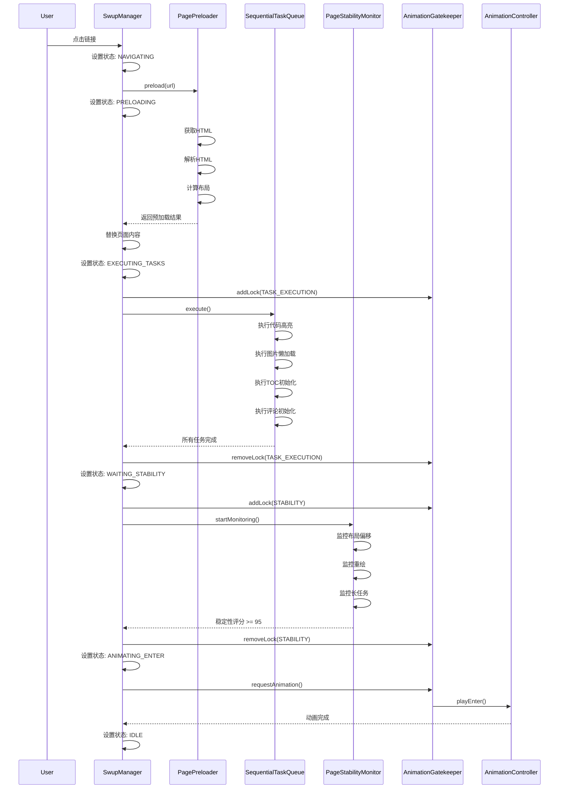

# PureSuck 后台预加载机制架构设计文档

## 文档版本
- **版本**: 1.0.0
- **创建日期**: 2026-01-14
- **作者**: Kilo Code (Architect Mode)

---

## 1. 概述

### 1.1 背景

当前系统在页面切换时存在长任务导致的掉帧问题。主要原因包括：
- 第三方库（如代码高亮、图片懒加载等）在主线程同步执行
- DOM解析和布局计算与动画执行并行
- 缺乏对页面稳定状态的检测机制
- 动画在页面内容未完全加载时就开始执行

### 1.2 核心目标

1. **后台预加载**：在后台完整加载并解析新页面的HTML结构，确保布局完全计算完毕
2. **顺序执行**：按顺序执行所有第三方库及脚本，直到页面内容完全渲染并处于静止状态
3. **动画分离**：只有当确认所有内容处理完成且状态稳定后，才触发Swup的页面切换及后续动画
4. **性能保证**：严禁在长任务执行期间启动进入动画，保证页面过渡期间主线程流畅

### 1.3 设计原则

- **模块化设计**：各模块职责清晰，高内聚低耦合
- **向后兼容**：与现有系统无缝集成，不破坏现有功能
- **性能优先**：避免阻塞主线程，使用requestIdleCallback和requestAnimationFrame
- **可调试性**：详细的日志输出和性能指标收集
- **容错能力**：完善的错误处理和降级方案

---

## 2. 整体架构

### 2.1 架构图（文字描述）

```
┌─────────────────────────────────────────────────────────────────┐
│                        用户交互层                                │
│  (点击链接、表单提交、浏览器导航)                                │
└────────────────────────┬────────────────────────────────────────┘
                         │
                         ▼
┌─────────────────────────────────────────────────────────────────┐
│                    SwupManager (现有)                            │
│  - 监听导航事件                                                  │
│  - 触发预加载流程                                                │
└────────────────────────┬────────────────────────────────────────┘
                         │
                         ▼
┌─────────────────────────────────────────────────────────────────┐
│              PagePreloader (新增 - 页面预加载器)                 │
│  ├─ 后台获取新页面HTML                                           │
│  ├─ 创建离屏DOM容器进行解析                                      │
│  ├─ 确保布局计算完成                                             │
│  └─ 返回预加载的页面数据                                         │
└────────────────────────┬────────────────────────────────────────┘
                         │
                         ▼
┌─────────────────────────────────────────────────────────────────┐
│         SequentialTaskQueue (新增 - 顺序任务队列)               │
│  ├─ 管理所有初始化任务的执行顺序                                 │
│  ├─ 确保任务按顺序执行，不并行                                   │
│  ├─ 支持任务优先级和依赖关系                                    │
│  └─ 与现有DOMScheduler集成                                      │
└────────────────────────┬────────────────────────────────────────┘
                         │
                         ▼
┌─────────────────────────────────────────────────────────────────┐
│       PageStabilityMonitor (新增 - 页面稳定监控器)                │
│  ├─ 检测页面是否处于静止状态                                     │
│  ├─ 监控布局重排、重绘、长任务                                    │
│  ├─ 确认所有异步操作完成                                         │
│  └─ 与现有PerformanceMonitor集成                                │
└────────────────────────┬────────────────────────────────────────┘
                         │
                         ▼
┌─────────────────────────────────────────────────────────────────┐
│      AnimationGatekeeper (新增 - 动画守门员)                    │
│  ├─ 控制动画触发时机                                             │
│  ├─ 确保只有在页面稳定后才触发动画                               │
│  ├─ 与SwupManager和AnimationController集成                       │
│  └─ 管理动画状态转换                                             │
└────────────────────────┬────────────────────────────────────────┘
                         │
                         ▼
┌─────────────────────────────────────────────────────────────────┐
│              AnimationController (现有)                          │
│  - 执行页面进入/退出动画                                         │
└────────────────────────┬────────────────────────────────────────┘
                         │
                         ▼
┌─────────────────────────────────────────────────────────────────┐
│                      用户可见的页面                              │
│  (内容完全加载，动画流畅执行)                                    │
└─────────────────────────────────────────────────────────────────┘

┌─────────────────────────────────────────────────────────────────┐
│                      核心基础设施层                              │
│  ├─ EventBus (事件总线)                                          │
│  ├─ StateManager (状态管理)                                      │
│  ├─ PerformanceMonitor (性能监控)                                │
│  ├─ AnimationFrameManager (动画帧管理)                          │
│  └─ DOMScheduler (DOM调度)                                       │
└─────────────────────────────────────────────────────────────────┘
```

### 2.2 模块依赖关系

```
SwupManager
    ├── PagePreloader (依赖: EventBus, PerformanceMonitor)
    ├── SequentialTaskQueue (依赖: DOMScheduler, EventBus)
    ├── PageStabilityMonitor (依赖: PerformanceMonitor, EventBus)
    └── AnimationGatekeeper (依赖: StateManager, EventBus, AnimationController)

AnimationGatekeeper
    └── AnimationController (现有)
```

### 2.3 新增导航状态

需要在现有的 [`StateManager`](js/core/StateManager.js:15) 中添加新的导航状态：

```javascript
export const NavigationState = {
    IDLE: 'idle',
    NAVIGATING: 'navigating',
    PRELOADING: 'preloading',           // 新增：预加载中
    EXECUTING_TASKS: 'executing_tasks', // 新增：执行初始化任务
    WAITING_STABILITY: 'waiting_stability', // 新增：等待页面稳定
    ANIMATING_EXIT: 'animating_exit',
    ANIMATING_ENTER: 'animating_enter',
    ERROR: 'error'
};
```

---

## 3. 核心模块详细设计

### 3.1 PagePreloader（页面预加载器）

#### 3.1.1 职责

- 在后台获取新页面的HTML内容
- 创建离屏DOM容器进行解析
- 确保布局计算完成
- 提取关键资源（图片、脚本等）
- 返回预加载的页面数据

#### 3.1.2 类结构

```javascript
/**
 * 预加载状态枚举
 */
export const PreloadState = {
    IDLE: 'idle',
    FETCHING: 'fetching',
    PARSING: 'parsing',
    COMPUTING_LAYOUT: 'computing_layout',
    COMPLETED: 'completed',
    FAILED: 'failed'
};

/**
 * 预加载结果
 * @typedef {Object} PreloadResult
 * @property {string} html - HTML内容
 * @property {DocumentFragment} fragment - DOM片段
 * @property {Array<string>} scripts - 脚本URL列表
 * @property {Array<string>} stylesheets - 样式表URL列表
 * @property {Array<string>} images - 图片URL列表
 * @property {number} loadTime - 加载耗时(ms)
 * @property {number} parseTime - 解析耗时(ms)
 * @property {number} layoutTime - 布局计算耗时(ms)
 */

export class PagePreloader {
    constructor(options = {}) {
        this._state = PreloadState.IDLE;
        this._cache = new Map();
        this._maxCacheSize = 10;
        this._currentPreload = null;
        this._offscreenContainer = null;
        
        // 配置
        this._enableCache = options.enableCache !== false;
        this._preloadImages = options.preloadImages !== false;
        this._preloadScripts = options.preloadScripts !== false;
        this._maxPreloadTime = options.maxPreloadTime || 5000; // 5秒超时
        
        // 性能监控
        this._performanceMetrics = {
            fetchTime: 0,
            parseTime: 0,
            layoutTime: 0,
            totalTime: 0
        };
        
        this._setupEventListeners();
    }
    
    /**
     * 预加载页面
     * @param {string} url - 目标URL
     * @returns {Promise<PreloadResult>}
     */
    async preload(url) { }
    
    /**
     * 获取预加载的页面
     * @param {string} url - 目标URL
     * @returns {PreloadResult|null}
     */
    getPreloaded(url) { }
    
    /**
     * 清除缓存
     */
    clearCache() { }
    
    /**
     * 取消当前预加载
     */
    cancel() { }
    
    // 私有方法
    _fetchPage(url) { }
    _parseHTML(html) { }
    _computeLayout(fragment) { }
    _preloadResources(urls) { }
    _createOffscreenContainer() { }
    _cleanupOffscreenContainer() { }
}
```

#### 3.1.3 关键方法实现要点

**preload() 方法流程**：

1. 检查缓存，如果已预加载则直接返回
2. 设置状态为 FETCHING
3. 使用 fetch API 获取页面HTML
4. 创建离屏DOM容器（使用 `display: none` 或 `visibility: hidden`）
5. 解析HTML并插入到离屏容器
6. 触发强制重排以完成布局计算
7. 提取资源URL（脚本、样式、图片）
8. 预加载关键资源
9. 返回预加载结果

**离屏容器创建**：

```javascript
_createOffscreenContainer() {
    if (this._offscreenContainer) return;
    
    // 创建隐藏容器
    this._offscreenContainer = document.createElement('div');
    this._offscreenContainer.style.cssText = `
        position: absolute;
        top: -9999px;
        left: -9999px;
        visibility: hidden;
        pointer-events: none;
        z-index: -1;
    `;
    document.body.appendChild(this._offscreenContainer);
}
```

**布局计算触发**：

```javascript
_computeLayout(fragment) {
    const start = performance.now();
    
    // 插入到离屏容器
    this._offscreenContainer.appendChild(fragment);
    
    // 强制触发重排
    void this._offscreenContainer.offsetHeight;
    
    // 等待下一帧确保布局完成
    await new Promise(resolve => requestAnimationFrame(resolve));
    
    // 再次强制触发重排
    void this._offscreenContainer.offsetHeight;
    
    this._performanceMetrics.layoutTime = performance.now() - start;
}
```

#### 3.1.4 与现有系统集成

- 通过 [`EventBus`](js/core/EventBus.js:6) 发布预加载事件
- 使用 [`PerformanceMonitor`](js/core/PerformanceMonitor.js:9) 记录性能指标
- 与 [`SwupManager`](js/navigation/SwupManager.js:55) 集成，在导航开始时触发预加载

---

### 3.2 SequentialTaskQueue（顺序任务队列）

#### 3.2.1 职责

- 管理所有页面初始化任务的执行顺序
- 确保任务按顺序执行，不并行
- 支持任务优先级和依赖关系
- 与现有 [`DOMScheduler`](js/rendering/DOMScheduler.js:73) 集成
- 提供任务执行进度和状态反馈

#### 3.2.2 类结构

```javascript
/**
 * 任务优先级
 */
export const TaskPriority = {
    CRITICAL: 'critical',  // 关键任务（必须立即执行）
    HIGH: 'high',          // 高优先级
    NORMAL: 'normal',      // 普通优先级
    LOW: 'low'            // 低优先级
};

/**
 * 任务状态
 */
export const TaskExecutionState = {
    PENDING: 'pending',
    EXECUTING: 'executing',
    COMPLETED: 'completed',
    FAILED: 'failed',
    CANCELLED: 'cancelled'
};

/**
 * 任务定义
 * @typedef {Object} QueuedTask
 * @property {string} id - 任务ID
 * @property {string} name - 任务名称
 * @property {Function} handler - 任务处理函数
 * @property {TaskPriority} priority - 优先级
 * @property {Array<string>} dependencies - 依赖的任务ID列表
 * @property {TaskExecutionState} state - 执行状态
 * @property {number} startTime - 开始时间
 * @property {number} endTime - 结束时间
 * @property {Error} error - 错误信息
 * @property {Object} metadata - 元数据
 */

export class SequentialTaskQueue {
    constructor(options = {}) {
        this._tasks = new Map(); // id -> task
        this._executionOrder = []; // 任务执行顺序
        this._currentIndex = 0;
        this._isExecuting = false;
        this._isPaused = false;
        
        // 配置
        this._enableProgressiveExecution = options.enableProgressiveExecution !== false;
        this._taskTimeout = options.taskTimeout || 3000; // 单个任务超时时间
        this._totalTimeout = options.totalTimeout || 10000; // 总超时时间
        
        // 性能监控
        this._metrics = {
            totalTasks: 0,
            completedTasks: 0,
            failedTasks: 0,
            totalTime: 0,
            averageTaskTime: 0
        };
        
        this._setupEventListeners();
    }
    
    /**
     * 添加任务
     * @param {string} id - 任务ID
     * @param {string} name - 任务名称
     * @param {Function} handler - 处理函数
     * @param {Object} options - 配置选项
     * @returns {SequentialTaskQueue}
     */
    addTask(id, name, handler, options = {}) { }
    
    /**
     * 执行所有任务
     * @returns {Promise<Object>}
     */
    async execute() { }
    
    /**
     * 暂停执行
     */
    pause() { }
    
    /**
     * 恢复执行
     */
    resume() { }
    
    /**
     * 取消执行
     */
    cancel() { }
    
    /**
     * 获取执行状态
     * @returns {Object}
     */
    getStatus() { }
    
    /**
     * 清空队列
     */
    clear() { }
    
    // 私有方法
    _resolveExecutionOrder() { }
    _executeNextTask() { }
    _executeTask(task) { }
    _checkDependencies(task) { }
    _handleTaskError(task, error) { }
    _updateMetrics() { }
}
```

#### 3.2.3 任务依赖解析

使用拓扑排序算法解析任务依赖关系：

```javascript
_resolveExecutionOrder() {
    const visited = new Set();
    const visiting = new Set();
    const order = [];
    
    const visit = (taskId) => {
        if (visited.has(taskId)) return;
        if (visiting.has(taskId)) {
            throw new Error(`Circular dependency detected: ${taskId}`);
        }
        
        visiting.add(taskId);
        
        const task = this._tasks.get(taskId);
        if (!task) return;
        
        // 先执行依赖的任务
        for (const depId of task.dependencies) {
            visit(depId);
        }
        
        visiting.delete(taskId);
        visited.add(taskId);
        order.push(taskId);
    };
    
    for (const taskId of this._tasks.keys()) {
        visit(taskId);
    }
    
    this._executionOrder = order;
}
```

#### 3.2.4 渐进式任务执行

与 [`DOMScheduler`](js/rendering/DOMScheduler.js:73) 集成，使用 `requestIdleCallback` 和 `requestAnimationFrame`：

```javascript
async _executeNextTask() {
    if (this._currentIndex >= this._executionOrder.length) {
        this._isExecuting = false;
        this._onComplete();
        return;
    }
    
    if (this._isPaused) {
        // 等待恢复
        return;
    }
    
    const taskId = this._executionOrder[this._currentIndex];
    const task = this._tasks.get(taskId);
    
    // 使用 requestIdleCallback 执行任务
    if (typeof requestIdleCallback === 'function') {
        requestIdleCallback(
            () => this._executeTask(task),
            { timeout: 100 }
        );
    } else {
        // 降级方案
        requestAnimationFrame(() => this._executeTask(task));
    }
}
```

#### 3.2.5 预定义任务类型

系统应提供常见的预定义任务：

```javascript
// 代码高亮任务
addTask('highlight', '代码高亮', async (container) => {
    if (typeof hljs !== 'undefined') {
        const blocks = container.querySelectorAll('pre code:not([data-highlighted])');
        for (const block of blocks) {
            hljs.highlightElement(block);
            block.dataset.highlighted = 'true';
        }
    }
});

// 图片懒加载任务
addTask('lazyload', '图片懒加载', async (container) => {
    if (typeof imageLazyLoader !== 'undefined') {
        imageLazyLoader.autoInit({ eagerCount: 3 });
    }
});

// TOC初始化任务
addTask('toc', '目录初始化', async (container) => {
    if (typeof initializeStickyTOC === 'function') {
        if (container.querySelector('#toc-section') || container.querySelector('.toc')) {
            initializeStickyTOC();
        }
    }
});

// 评论初始化任务
addTask('comments', '评论初始化', async (container) => {
    if (typeof initializeCommentsOwO === 'function') {
        initializeCommentsOwO();
    }
});
```

#### 3.2.6 与现有系统集成

- 通过 [`EventBus`](js/core/EventBus.js:6) 发布任务执行事件
- 使用 [`DOMScheduler`](js/rendering/DOMScheduler.js:73) 调度DOM操作
- 与 [`SwupManager`](js/navigation/SwupManager.js:55) 集成，在页面内容替换后执行

---

### 3.3 PageStabilityMonitor（页面稳定监控器）

#### 3.3.1 职责

- 检测页面是否处于静止状态
- 监控布局重排（Layout Shift）
- 监控重绘（Repaint）
- 监控长任务（Long Task）
- 确认所有异步操作完成
- 提供稳定性评分

#### 3.3.2 类结构

```javascript
/**
 * 稳定性状态
 */
export const StabilityState = {
    UNSTABLE: 'unstable',
    STABILIZING: 'stabilizing',
    STABLE: 'stable',
    TIMEOUT: 'timeout'
};

/**
 * 稳定性指标
 * @typedef {Object} StabilityMetrics
 * @property {number} layoutShifts - 布局偏移次数
 * @property {number} repaints - 重绘次数
 * @property {number} longTasks - 长任务数量
 * @property {number} score - 稳定性评分 (0-100)
 * @property {number} duration - 监控持续时间(ms)
 */

export class PageStabilityMonitor {
    constructor(options = {}) {
        this._state = StabilityState.UNSTABLE;
        this._isMonitoring = false;
        this._startTime = 0;
        
        // 配置
        this._stabilityThreshold = options.stabilityThreshold || 95; // 稳定性阈值
        this._monitorTimeout = options.monitorTimeout || 3000; // 监控超时时间
        this._quietWindowDuration = options.quietWindowDuration || 500; // 静默窗口持续时间
        
        // 指标
        this._metrics = {
            layoutShifts: 0,
            repaints: 0,
            longTasks: 0,
            score: 0,
            duration: 0
        };
        
        // 观察器
        this._layoutShiftObserver = null;
        this._performanceObserver = null;
        
        // 静默窗口
        this._quietWindowStart = 0;
        this._quietWindowTimer = null;
        
        this._setupEventListeners();
    }
    
    /**
     * 开始监控
     * @returns {Promise<StabilityMetrics>}
     */
    async startMonitoring() { }
    
    /**
     * 停止监控
     */
    stopMonitoring() { }
    
    /**
     * 获取当前稳定性指标
     * @returns {StabilityMetrics}
     */
    getMetrics() { }
    
    /**
     * 重置监控
     */
    reset() { }
    
    // 租有方法
    _setupLayoutShiftObserver() { }
    _setupPerformanceObserver() { }
    _onLayoutShift(entry) { }
    _onLongTask(entry) { }
    _calculateScore() { }
    _checkStability() { }
    _startQuietWindow() { }
    _resetQuietWindow() { }
}
```

#### 3.3.3 布局偏移监控

使用 `ResizeObserver` 监控布局变化：

```javascript
_setupLayoutShiftObserver() {
    if (typeof ResizeObserver === 'undefined') {
        console.warn('[PageStabilityMonitor] ResizeObserver not supported');
        return;
    }
    
    this._layoutShiftObserver = new ResizeObserver((entries) => {
        for (const entry of entries) {
            // 检查是否有实际的布局变化
            if (entry.contentRect.width > 0 || entry.contentRect.height > 0) {
                this._onLayoutShift(entry);
            }
        }
    });
    
    // 监控所有主要容器
    const containers = document.querySelectorAll('#swup, .wrapper, .post');
    containers.forEach(container => {
        this._layoutShiftObserver.observe(container);
    });
}
```

#### 3.3.4 长任务监控

与 [`PerformanceMonitor`](js/core/PerformanceMonitor.js:9) 集成：

```javascript
_setupPerformanceObserver() {
    if (typeof PerformanceObserver === 'undefined') {
        console.warn('[PageStabilityMonitor] PerformanceObserver not supported');
        return;
    }
    
    this._performanceObserver = new PerformanceObserver((list) => {
        const entries = list.getEntries();
        
        for (const entry of entries) {
            if (entry.entryType === 'longtask') {
                this._onLongTask(entry);
            }
        }
    });
    
    this._performanceObserver.observe({ entryTypes: ['longtask'] });
}
```

#### 3.3.5 稳定性评分算法

```javascript
_calculateScore() {
    const { layoutShifts, repaints, longTasks, duration } = this._metrics;
    
    // 基础分
    let score = 100;
    
    // 扣分：布局偏移（每次扣5分）
    score -= layoutShifts * 5;
    
    // 扣分：重绘（每次扣1分）
    score -= repaints * 1;
    
    // 扣分：长任务（每个扣10分）
    score -= longTasks * 10;
    
    // 扣分：持续时间过长（每100ms扣1分）
    const durationPenalty = Math.floor(duration / 100);
    score -= durationPenalty;
    
    // 确保分数在0-100之间
    score = Math.max(0, Math.min(100, score));
    
    this._metrics.score = score;
    
    return score;
}
```

#### 3.3.6 静默窗口机制

```javascript
_startQuietWindow() {
    this._quietWindowStart = Date.now();
    
    // 清除之前的定时器
    if (this._quietWindowTimer) {
        clearTimeout(this._quietWindowTimer);
    }
    
    // 设置新的静默窗口定时器
    this._quietWindowTimer = setTimeout(() => {
        // 静默窗口结束，检查稳定性
        this._checkStability();
    }, this._quietWindowDuration);
}

_resetQuietWindow() {
    // 重置静默窗口
    if (this._quietWindowTimer) {
        clearTimeout(this._quietWindowTimer);
        this._quietWindowTimer = null;
    }
    this._quietWindowStart = 0;
}
```

#### 3.3.7 与现有系统集成

- 通过 [`EventBus`](js/core/EventBus.js:6) 发布稳定性事件
- 使用 [`PerformanceMonitor`](js/core/PerformanceMonitor.js:9) 获取长任务数据
- 与 [`AnimationGatekeeper`](#34-animationgatekeeper-动画守门员) 集成，提供稳定性反馈

---

### 3.4 AnimationGatekeeper（动画守门员）

#### 3.4.1 职责

- 控制动画触发时机
- 确保只有在页面稳定后才触发动画
- 与 [`SwupManager`](js/navigation/SwupManager.js:55) 和 [`AnimationController`](js/animation/AnimationController.js:53) 集成
- 管理动画状态转换
- 提供动画锁机制

#### 3.4.2 类结构

```javascript
/**
 * 守门员状态
 */
export const GatekeeperState = {
    LOCKED: 'locked',           // 锁定，不允许动画
    WAITING: 'waiting',         // 等待条件满足
    READY: 'ready',            // 准备就绪，可以触发动画
    ANIMATING: 'animating',     // 动画执行中
    COMPLETED: 'completed'      // 动画完成
};

/**
 * 动画锁类型
 */
export const LockType = {
    PRELOADING: 'preloading',
    TASK_EXECUTION: 'task_execution',
    STABILITY: 'stability',
    MANUAL: 'manual'
};

export class AnimationGatekeeper {
    constructor(options = {}) {
        this._state = GatekeeperState.LOCKED;
        this._locks = new Map(); // lockType -> reason
        this._pendingAnimation = null;
        
        // 配置
        this._enableAutoUnlock = options.enableAutoUnlock !== false;
        this._unlockTimeout = options.unlockTimeout || 5000; // 自动解锁超时
        
        // 依赖
        this._stabilityMonitor = options.stabilityMonitor;
        this._taskQueue = options.taskQueue;
        
        this._setupEventListeners();
    }
    
    /**
     * 请求执行动画
     * @param {Function} animationFn - 动画函数
     * @returns {Promise<boolean>}
     */
    async requestAnimation(animationFn) { }
    
    /**
     * 添加锁
     * @param {LockType} type - 锁类型
     * @param {string} reason - 锁定原因
     */
    addLock(type, reason) { }
    
    /**
     * 移除锁
     * @param {LockType} type - 锁类型
     */
    removeLock(type) { }
    
    /**
     * 检查是否可以执行动画
     * @returns {boolean}
     */
    canAnimate() { }
    
    /**
     * 强制解锁
     */
    forceUnlock() { }
    
    /**
     * 获取当前状态
     * @returns {Object}
     */
    getStatus() { }
    
    // 私有方法
    _checkReadyState() { }
    _executeAnimation(animationFn) { }
    _onStabilityAchieved(metrics) { }
    _onTasksCompleted(result) { }
    _setupEventListeners() { }
}
```

#### 3.4.3 动画锁机制

```javascript
addLock(type, reason) {
    this._locks.set(type, {
        reason,
        timestamp: Date.now()
    });
    
    this._state = GatekeeperState.LOCKED;
    
    console.log(`[AnimationGatekeeper] Lock added: ${type}, reason: ${reason}`);
    
    eventBus.emit('gatekeeper:locked', { type, reason });
}

removeLock(type) {
    if (!this._locks.has(type)) return;
    
    this._locks.delete(type);
    
    // 检查是否还有其他锁
    if (this._locks.size === 0) {
        this._state = GatekeeperState.READY;
        console.log('[AnimationGatekeeper] All locks removed, ready to animate');
        
        eventBus.emit('gatekeeper:ready');
    } else {
        console.log(`[AnimationGatekeeper] Lock removed: ${type}, remaining locks: ${this._locks.size}`);
    }
}
```

#### 3.4.4 动画请求处理

```javascript
async requestAnimation(animationFn) {
    // 检查是否可以执行动画
    if (!this.canAnimate()) {
        console.log('[AnimationGatekeeper] Cannot animate, locks present:', Array.from(this._locks.keys()));
        
        // 保存待执行的动画
        this._pendingAnimation = animationFn;
        
        // 等待解锁
        return new Promise((resolve) => {
            const unsubscribe = eventBus.on('gatekeeper:ready', () => {
                unsubscribe();
                this._executeAnimation(animationFn).then(resolve);
            });
        });
    }
    
    // 直接执行动画
    return this._executeAnimation(animationFn);
}
```

#### 3.4.5 与现有系统集成

- 通过 [`EventBus`](js/core/EventBus.js:6) 监听稳定性事件
- 使用 [`StateManager`](js/core/StateManager.js:55) 管理导航状态
- 与 [`SwupManager`](js/navigation/SwupManager.js:55) 集成，控制页面切换动画
- 与 [`AnimationController`](js/animation/AnimationController.js:53) 集成，执行实际动画

---

## 4. 执行流程

### 4.1 完整导航流程

```
用户点击链接
    │
    ▼
SwupManager 监听到导航事件
    │
    ▼
设置状态: IDLE → NAVIGATING
    │
    ▼
触发 PagePreloader.preload(url)
    │
    ├─ 设置状态: NAVIGATING → PRELOADING
    │
    ├─ 后台获取页面HTML
    │
    ├─ 创建离屏DOM容器
    │
    ├─ 解析HTML并插入
    │
    ├─ 触发布局计算
    │
    ├─ 预加载资源
    │
    └─ 返回预加载结果
    │
    ▼
Swup 执行页面内容替换
    │
    ▼
设置状态: PRELOADING → EXECUTING_TASKS
    │
    ▼
AnimationGatekeeper.addLock(TASK_EXECUTION)
    │
    ▼
SequentialTaskQueue.execute()
    │
    ├─ 按顺序执行所有初始化任务
    │
    ├─ 代码高亮
    │
    ├─ 图片懒加载
    │
    ├─ TOC初始化
    │
    ├─ 评论初始化
    │
    └─ 其他自定义任务
    │
    ▼
所有任务完成
    │
    ▼
AnimationGatekeeper.removeLock(TASK_EXECUTION)
    │
    ▼
设置状态: EXECUTING_TASKS → WAITING_STABILITY
    │
    ▼
AnimationGatekeeper.addLock(STABILITY)
    │
    ▼
PageStabilityMonitor.startMonitoring()
    │
    ├─ 监控布局偏移
    │
    ├─ 监控重绘
    │
    ├─ 监控长任务
    │
    └─ 计算稳定性评分
    │
    ▼
稳定性评分 >= 阈值 (95)
    │
    ▼
AnimationGatekeeper.removeLock(STABILITY)
    │
    ▼
设置状态: WAITING_STABILITY → ANIMATING_ENTER
    │
    ▼
AnimationGatekeeper.requestAnimation()
    │
    ▼
AnimationController.playEnter()
    │
    ▼
动画完成
    │
    ▼
设置状态: ANIMATING_ENTER → IDLE
    │
    ▼
页面切换完成，用户可见
```

### 4.2 Mermaid 流程图



### 4.3 错误处理流程

```
任何阶段发生错误
    │
    ▼
ErrorBoundary 捕获错误
    │
    ▼
记录错误日志
    │
    ▼
设置状态: ERROR
    │
    ▼
触发降级方案
    │
    ├─ 取消预加载
    │
    ├─ 停止任务队列
    │
    ├─ 停止稳定性监控
    │
    └─ 强制解锁动画守门员
    │
    ▼
执行简化动画或跳过动画
    │
    ▼
恢复到 IDLE 状态
    │
    ▼
显示错误提示（可选）
```

---

## 5. 与现有系统集成方案

### 5.1 SwupManager 集成

在 [`SwupManager`](js/navigation/SwupManager.js:55) 中集成预加载机制：

```javascript
// 在 SwupManager 构造函数中初始化新模块
constructor(options = {}) {
    // ... 现有代码 ...
    
    // 初始化新模块
    this._pagePreloader = new PagePreloader({
        enableCache: true,
        preloadImages: true,
        preloadScripts: false
    });
    
    this._taskQueue = new SequentialTaskQueue({
        enableProgressiveExecution: true,
        taskTimeout: 3000,
        totalTimeout: 10000
    });
    
    this._stabilityMonitor = new PageStabilityMonitor({
        stabilityThreshold: 95,
        monitorTimeout: 3000,
        quietWindowDuration: 500
    });
    
    this._animationGatekeeper = new AnimationGatekeeper({
        stabilityMonitor: this._stabilityMonitor,
        taskQueue: this._taskQueue,
        enableAutoUnlock: true,
        unlockTimeout: 5000
    });
}

// 修改 _onVisitStart 方法
async _onVisitStart(visit) {
    stateManager.setState(NavigationState.NAVIGATING, { url: visit.to?.url });
    
    // 预加载页面
    stateManager.setState(NavigationState.PRELOADING);
    try {
        const preloadResult = await this._pagePreloader.preload(visit.to?.url);
        console.log('[SwupManager] Page preloaded:', preloadResult);
    } catch (error) {
        console.error('[SwupManager] Preload failed:', error);
        // 继续执行，不阻塞导航
    }
    
    // ... 现有代码 ...
}

// 修改 _onPageView 方法
async _onPageView() {
    const pageType = routeManager.getCurrentPageType();
    const token = ++this._currentPageToken;
    const isCurrent = () => token === this._currentPageToken;
    
    // 更新导航栏
    this._updateNavigation();
    
    // 执行初始化任务
    stateManager.setState(NavigationState.EXECUTING_TASKS);
    this._animationGatekeeper.addLock(LockType.TASK_EXECUTION);
    
    try {
        await this._taskQueue.execute();
        console.log('[SwupManager] All tasks completed');
    } catch (error) {
        console.error('[SwupManager] Task execution failed:', error);
    } finally {
        this._animationGatekeeper.removeLock(LockType.TASK_EXECUTION);
    }
    
    // 等待页面稳定
    stateManager.setState(NavigationState.WAITING_STABILITY);
    this._animationGatekeeper.addLock(LockType.STABILITY);
    
    try {
        const stabilityMetrics = await this._stabilityMonitor.startMonitoring();
        console.log('[SwupManager] Page stability achieved:', stabilityMetrics);
    } catch (error) {
        console.error('[SwupManager] Stability monitoring failed:', error);
    } finally {
        this._animationGatekeeper.removeLock(LockType.STABILITY);
    }
    
    // 触发进入动画
    stateManager.setState(NavigationState.ANIMATING_ENTER);
    
    await this._animationGatekeeper.requestAnimation(() => {
        return animationController.playEnter(this._getEnterElements(pageType), {
            pageType
        });
    });
    
    // ... 现有代码 ...
}
```

### 5.2 StateManager 扩展

在 [`StateManager`](js/core/StateManager.js:15) 中添加新的导航状态：

```javascript
export const NavigationState = {
    IDLE: 'idle',
    NAVIGATING: 'navigating',
    PRELOADING: 'preloading',           // 新增
    EXECUTING_TASKS: 'executing_tasks', // 新增
    WAITING_STABILITY: 'waiting_stability', // 新增
    ANIMATING_EXIT: 'animating_exit',
    ANIMATING_ENTER: 'animating_enter',
    ERROR: 'error'
};

// 更新状态转换规则
const STATE_TRANSITIONS = {
    [NavigationState.IDLE]: [NavigationState.NAVIGATING],
    [NavigationState.NAVIGATING]: [NavigationState.PRELOADING, NavigationState.ERROR],
    [NavigationState.PRELOADING]: [NavigationState.ANIMATING_EXIT, NavigationState.ERROR],
    [NavigationState.ANIMATING_EXIT]: [NavigationState.EXECUTING_TASKS, NavigationState.ERROR],
    [NavigationState.EXECUTING_TASKS]: [NavigationState.WAITING_STABILITY, NavigationState.ERROR],
    [NavigationState.WAITING_STABILITY]: [NavigationState.ANIMATING_ENTER, NavigationState.ERROR],
    [NavigationState.ANIMATING_ENTER]: [NavigationState.IDLE, NavigationState.ERROR],
    [NavigationState.ERROR]: [NavigationState.IDLE]
};
```

### 5.3 EventBus 事件定义

定义新的事件名称：

```javascript
// PagePreloader 事件
export const PreloaderEvents = {
    PRELOAD_START: 'preloader:start',
    PRELOAD_COMPLETE: 'preloader:complete',
    PRELOAD_FAILED: 'preloader:failed',
    PRELOAD_CACHED: 'preloader:cached'
};

// SequentialTaskQueue 事件
export const TaskQueueEvents = {
    TASK_ADDED: 'taskQueue:taskAdded',
    TASK_STARTED: 'taskQueue:taskStarted',
    TASK_COMPLETED: 'taskQueue:taskCompleted',
    TASK_FAILED: 'taskQueue:taskFailed',
    QUEUE_STARTED: 'taskQueue:started',
    QUEUE_COMPLETED: 'taskQueue:completed',
    QUEUE_FAILED: 'taskQueue:failed',
    QUEUE_PAUSED: 'taskQueue:paused',
    QUEUE_RESUMED: 'taskQueue:resumed'
};

// PageStabilityMonitor 事件
export const StabilityEvents = {
    MONITORING_STARTED: 'stability:started',
    MONITORING_STOPPED: 'stability:stopped',
    STABILITY_ACHIEVED: 'stability:achieved',
    STABILITY_TIMEOUT: 'stability:timeout',
    LAYOUT_SHIFT: 'stability:layoutShift',
    LONG_TASK: 'stability:longTask'
};

// AnimationGatekeeper 事件
export const GatekeeperEvents = {
    LOCKED: 'gatekeeper:locked',
    UNLOCKED: 'gatekeeper:unlocked',
    READY: 'gatekeeper:ready',
    ANIMATION_REQUESTED: 'gatekeeper:animationRequested',
    ANIMATION_STARTED: 'gatekeeper:animationStarted',
    ANIMATION_COMPLETED: 'gatekeeper:animationCompleted'
};
```

---

## 6. 错误处理和降级策略

### 6.1 错误类型定义

```javascript
export const PreloadErrorType = {
    NETWORK_ERROR: 'network_error',
    PARSE_ERROR: 'parse_error',
    TIMEOUT_ERROR: 'timeout_error',
    CACHE_ERROR: 'cache_error'
};

export const TaskErrorType = {
    TASK_TIMEOUT: 'task_timeout',
    TASK_FAILED: 'task_failed',
    CIRCULAR_DEPENDENCY: 'circular_dependency',
    QUEUE_TIMEOUT: 'queue_timeout'
};

export const StabilityErrorType = {
    MONITOR_TIMEOUT: 'monitor_timeout',
    OBSERVER_ERROR: 'observer_error'
};

export const GatekeeperErrorType = {
    LOCK_TIMEOUT: 'lock_timeout',
    ANIMATION_FAILED: 'animation_failed'
};
```

### 6.2 错误处理策略

#### 6.2.1 预加载失败

```javascript
try {
    const result = await this._pagePreloader.preload(url);
} catch (error) {
    // 降级方案：直接导航，不使用预加载
    console.warn('[SwupManager] Preload failed, falling back to direct navigation');
    
    // 记录错误
    ErrorBoundary.handle(error, {
        type: ErrorType.NETWORK,
        severity: ErrorSeverity.MEDIUM,
        message: '预加载失败，使用直接导航',
        metadata: { url }
    });
    
    // 继续执行导航流程
}
```

#### 6.2.2 任务执行失败

```javascript
try {
    await this._taskQueue.execute();
} catch (error) {
    // 降级方案：跳过失败的任务，继续执行
    console.warn('[SwupManager] Task execution failed, continuing with stability check');
    
    // 记录错误
    ErrorBoundary.handle(error, {
        type: ErrorType.RENDERING,
        severity: ErrorSeverity.MEDIUM,
        message: '部分任务执行失败',
        metadata: { failedTasks: this._taskQueue.getFailedTasks() }
    });
    
    // 继续执行稳定性检查
}
```

#### 6.2.3 稳定性监控超时

```javascript
try {
    const metrics = await this._stabilityMonitor.startMonitoring();
} catch (error) {
    // 降级方案：强制执行动画
    console.warn('[SwupManager] Stability monitoring timeout, forcing animation');
    
    // 记录错误
    ErrorBoundary.handle(error, {
        type: ErrorType.PERFORMANCE,
        severity: ErrorSeverity.LOW,
        message: '稳定性监控超时，强制执行动画'
    });
    
    // 强制解锁
    this._animationGatekeeper.forceUnlock();
}
```

#### 6.2.4 动画执行失败

```javascript
try {
    await this._animationGatekeeper.requestAnimation(() => {
        return animationController.playEnter(elements, config);
    });
} catch (error) {
    // 降级方案：跳过动画，直接显示内容
    console.warn('[SwupManager] Animation failed, showing content immediately');
    
    // 记录错误
    ErrorBoundary.handle(error, {
        type: ErrorType.ANIMATION,
        severity: ErrorSeverity.LOW,
        message: '动画执行失败，直接显示内容'
    });
    
    // 立即显示元素
    elements.forEach(el => {
        el.style.opacity = '1';
        el.style.transform = '';
    });
}
```

### 6.3 超时机制

```javascript
// 预加载超时
const preloadPromise = this._pagePreloader.preload(url);
const timeoutPromise = new Promise((_, reject) => {
    setTimeout(() => reject(new Error('Preload timeout')), 5000);
});

try {
    const result = await Promise.race([preloadPromise, timeoutPromise]);
} catch (error) {
    if (error.message === 'Preload timeout') {
        console.warn('[SwupManager] Preload timeout, using cached or direct navigation');
    }
}

// 任务队列超时
const taskPromise = this._taskQueue.execute();
const taskTimeoutPromise = new Promise((_, reject) => {
    setTimeout(() => reject(new Error('Task queue timeout')), 10000);
});

try {
    await Promise.race([taskPromise, taskTimeoutPromise]);
} catch (error) {
    if (error.message === 'Task queue timeout') {
        console.warn('[SwupManager] Task queue timeout, forcing continue');
        this._taskQueue.cancel();
    }
}

// 稳定性监控超时
const stabilityPromise = this._stabilityMonitor.startMonitoring();
const stabilityTimeoutPromise = new Promise((_, reject) => {
    setTimeout(() => reject(new Error('Stability monitoring timeout')), 3000);
});

try {
    const metrics = await Promise.race([stabilityPromise, stabilityTimeoutPromise]);
} catch (error) {
    if (error.message === 'Stability monitoring timeout') {
        console.warn('[SwupManager] Stability monitoring timeout, forcing animation');
        this._stabilityMonitor.stopMonitoring();
    }
}
```

### 6.4 降级方案总结

| 场景 | 降级方案 | 影响 |
|------|---------|------|
| 预加载失败 | 直接导航，不使用预加载 | 页面加载时间略长 |
| 任务执行失败 | 跳过失败任务，继续执行 | 部分功能可能不可用 |
| 稳定性监控超时 | 强制执行动画 | 可能仍有轻微掉帧 |
| 动画执行失败 | 跳过动画，直接显示内容 | 无动画效果 |
| 所有模块失败 | 完全降级到传统导航 | 用户体验最差 |

---

## 7. 性能优化建议

### 7.1 预加载优化

1. **智能缓存策略**
   - 使用 LRU 缓存策略，限制缓存大小
   - 根据用户访问模式预测可能访问的页面
   - 在空闲时预加载可能访问的页面

2. **资源优先级**
   - 只预加载关键资源（首屏图片、关键脚本）
   - 使用 `<link rel="preload">` 提示浏览器优先加载
   - 延迟加载非关键资源

3. **离屏容器优化**
   - 使用 `content-visibility: auto` 优化离屏渲染
   - 避免在离屏容器中执行不必要的脚本
   - 使用 `will-change` 提示浏览器优化

### 7.2 任务队列优化

1. **任务分片**
   - 将大任务拆分为小任务，每个任务执行时间 < 16ms
   - 使用 `requestIdleCallback` 在空闲时执行低优先级任务
   - 使用 `requestAnimationFrame` 执行高优先级任务

2. **并行化优化**
   - 对于无依赖关系的任务，考虑并行执行
   - 使用 Web Workers 执行计算密集型任务
   - 使用 `Promise.all` 并行执行独立任务

3. **任务优先级**
   - 关键任务（如布局计算）优先执行
   - 次要任务（如统计代码）延迟执行
   - 可选任务（如推荐内容）按需执行

### 7.3 稳定性监控优化

1. **采样优化**
   - 使用节流（throttle）减少事件触发频率
   - 只监控关键容器，减少观察器数量
   - 使用 `IntersectionObserver` 优化可见性检测

2. **评分算法优化**
   - 使用加权评分，不同类型的偏移权重不同
   - 考虑偏移的视觉影响，而非绝对值
   - 使用移动平均平滑评分波动

3. **静默窗口优化**
   - 根据页面复杂度动态调整静默窗口持续时间
   - 使用指数退避策略，逐步增加静默窗口时间
   - 在检测到持续不稳定时，提前结束监控

### 7.4 动画优化

1. **动画属性优化**
   - 只动画 `transform` 和 `opacity` 属性
   - 使用 `will-change` 提示浏览器优化
   - 避免动画 `width`、`height` 等布局属性

2. **动画时机优化**
   - 在页面完全稳定后再触发动画
   - 使用 `requestAnimationFrame` 确保动画在正确的帧开始
   - 避免在动画执行期间执行其他任务

3. **动画性能优化**
   - 使用 CSS 动画而非 JavaScript 动画
   - 使用 `transform: translate3d` 启用硬件加速
   - 减少动画元素数量，使用分组动画

### 7.5 内存优化

1. **缓存清理**
   - 定期清理预加载缓存
   - 清理不再使用的 DOM 节点
   - 清理事件监听器

2. **对象池**
   - 重用 DOM 节点，减少创建和销毁
   - 使用对象池管理动画对象
   - 重用事件对象

3. **内存监控**
   - 监控内存使用情况
   - 在内存使用过高时清理缓存
   - 使用 `WeakMap` 和 `WeakSet` 避免内存泄漏

---

## 8. 可调试性

### 8.1 日志输出

每个模块应提供详细的日志输出：

```javascript
// PagePreloader 日志
console.log('[PagePreloader] Preloading:', url);
console.log('[PagePreloader] Fetched in:', fetchTime, 'ms');
console.log('[PagePreloader] Parsed in:', parseTime, 'ms');
console.log('[PagePreloader] Layout computed in:', layoutTime, 'ms');

// SequentialTaskQueue 日志
console.log('[SequentialTaskQueue] Task added:', taskId, taskName);
console.log('[SequentialTaskQueue] Executing task:', taskId);
console.log('[SequentialTaskQueue] Task completed:', taskId, 'in:', duration, 'ms');
console.log('[SequentialTaskQueue] All tasks completed in:', totalTime, 'ms');

// PageStabilityMonitor 日志
console.log('[PageStabilityMonitor] Monitoring started');
console.log('[PageStabilityMonitor] Layout shift detected:', entry);
console.log('[PageStabilityMonitor] Long task detected:', entry);
console.log('[PageStabilityMonitor] Stability achieved:', metrics);

// AnimationGatekeeper 日志
console.log('[AnimationGatekeeper] Lock added:', type, reason);
console.log('[AnimationGatekeeper] Lock removed:', type);
console.log('[AnimationGatekeeper] Animation requested');
console.log('[AnimationGatekeeper] Animation started');
console.log('[AnimationGatekeeper] Animation completed');
```

### 8.2 性能指标收集

每个模块应提供性能指标：

```javascript
// PagePreloader 性能指标
getPerformanceMetrics() {
    return {
        fetchTime: this._performanceMetrics.fetchTime,
        parseTime: this._performanceMetrics.parseTime,
        layoutTime: this._performanceMetrics.layoutTime,
        totalTime: this._performanceMetrics.totalTime,
        cacheHitRate: this._calculateCacheHitRate()
    };
}

// SequentialTaskQueue 性能指标
getPerformanceMetrics() {
    return {
        totalTasks: this._metrics.totalTasks,
        completedTasks: this._metrics.completedTasks,
        failedTasks: this._metrics.failedTasks,
        totalTime: this._metrics.totalTime,
        averageTaskTime: this._metrics.averageTaskTime,
        taskBreakdown: this._getTaskBreakdown()
    };
}

// PageStabilityMonitor 性能指标
getPerformanceMetrics() {
    return {
        layoutShifts: this._metrics.layoutShifts,
        repaints: this._metrics.repaints,
        longTasks: this._metrics.longTasks,
        score: this._metrics.score,
        duration: this._metrics.duration,
        timeline: this._getStabilityTimeline()
    };
}

// AnimationGatekeeper 性能指标
getPerformanceMetrics() {
    return {
        totalLocks: this._locks.size,
        lockDurations: this._getLockDurations(),
        animationDuration: this._animationDuration,
        totalWaitTime: this._totalWaitTime
    };
}
```

### 8.3 调试模式

提供调试模式开关：

```javascript
// 全局调试配置
window.PureSuckDebug = {
    enabled: true,
    logLevel: 'verbose', // verbose, info, warn, error
    showPerformanceMetrics: true,
    showTimeline: true
};

// 在模块中使用
if (window.PureSuckDebug?.enabled) {
    console.log('[Module] Debug message');
}

if (window.PureSuckDebug?.logLevel === 'verbose') {
    console.log('[Module] Verbose message');
}
```

### 8.4 开发者工具

提供开发者工具面板：

```javascript
// 开发者工具面板
class PureSuckDevTools {
    constructor() {
        this._panel = null;
        this._tabs = ['Overview', 'Preloader', 'TaskQueue', 'Stability', 'Gatekeeper'];
        this._currentTab = 'Overview';
    }
    
    show() {
        if (this._panel) return;
        
        this._createPanel();
        this._renderCurrentTab();
    }
    
    hide() {
        if (this._panel) {
            this._panel.remove();
            this._panel = null;
        }
    }
    
    _createPanel() {
        // 创建开发者工具面板
        this._panel = document.createElement('div');
        this._panel.className = 'puresuck-devtools';
        this._panel.innerHTML = `
            <div class="puresuck-devtools-header">
                <h3>PureSuck DevTools</h3>
                <button class="puresuck-devtools-close">×</button>
            </div>
            <div class="puresuck-devtools-tabs">
                ${this._tabs.map(tab => `
                    <button class="puresuck-devtools-tab ${tab === this._currentTab ? 'active' : ''}" data-tab="${tab}">
                        ${tab}
                    </button>
                `).join('')}
            </div>
            <div class="puresuck-devtools-content"></div>
        `;
        
        document.body.appendChild(this._panel);
        this._setupEventListeners();
    }
    
    _renderCurrentTab() {
        const content = this._panel.querySelector('.puresuck-devtools-content');
        
        switch (this._currentTab) {
            case 'Overview':
                content.innerHTML = this._renderOverview();
                break;
            case 'Preloader':
                content.innerHTML = this._renderPreloader();
                break;
            case 'TaskQueue':
                content.innerHTML = this._renderTaskQueue();
                break;
            case 'Stability':
                content.innerHTML = this._renderStability();
                break;
            case 'Gatekeeper':
                content.innerHTML = this._renderGatekeeper();
                break;
        }
    }
    
    _renderOverview() {
        return `
            <h4>Overview</h4>
            <div class="puresuck-devtools-metrics">
                <div class="metric">
                    <label>Navigation State:</label>
                    <span>${stateManager.getCurrentState()}</span>
                </div>
                <div class="metric">
                    <label>Performance Level:</label>
                    <span>${animationController.getPerformanceLevel()}</span>
                </div>
                <div class="metric">
                    <label>Active Animations:</label>
                    <span>${animationController.getActiveCount()}</span>
                </div>
            </div>
        `;
    }
    
    // ... 其他渲染方法
}

// 创建全局实例
window.pureSuckDevTools = new PureSuckDevTools();
```

---

## 9. 实施计划

### 9.1 阶段划分

#### 阶段 1：基础设施（1-2周）

- 扩展 [`StateManager`](js/core/StateManager.js:55)，添加新的导航状态
- 更新状态转换规则
- 定义新的事件名称
- 创建开发者工具框架

#### 阶段 2：PagePreloader（1周）

- 实现 [`PagePreloader`](#311-pagepreloader页面预加载器) 类
- 实现离屏容器创建和清理
- 实现布局计算触发
- 实现资源预加载
- 集成到 [`SwupManager`](js/navigation/SwupManager.js:55)

#### 阶段 3：SequentialTaskQueue（1-2周）

- 实现 [`SequentialTaskQueue`](#32-sequentialtaskqueue顺序任务队列) 类
- 实现任务依赖解析
- 实现渐进式任务执行
- 实现预定义任务
- 集成到 [`SwupManager`](js/navigation/SwupManager.js:55)

#### 阶段 4：PageStabilityMonitor（1周）

- 实现 [`PageStabilityMonitor`](#33-pagestabilitymonitor页面稳定监控器) 类
- 实现布局偏移监控
- 实现长任务监控
- 实现稳定性评分算法
- 集成到 [`SwupManager`](js/navigation/SwupManager.js:55)

#### 阶段 5：AnimationGatekeeper（1周）

- 实现 [`AnimationGatekeeper`](#34-animationgatekeeper动画守门员) 类
- 实现动画锁机制
- 实现动画请求处理
- 集成到 [`SwupManager`](js/navigation/SwupManager.js:55) 和 [`AnimationController`](js/animation/AnimationController.js:53)

#### 阶段 6：集成和测试（1-2周）

- 完整集成所有模块
- 编写单元测试
- 编写集成测试
- 性能测试和优化
- 错误处理测试

#### 阶段 7：文档和发布（1周）

- 编写用户文档
- 编写开发者文档
- 编写 API 文档
- 发布新版本

### 9.2 风险和缓解措施

| 风险 | 影响 | 缓解措施 |
|------|------|---------|
| 预加载失败 | 页面加载时间增加 | 提供降级方案，直接导航 |
| 任务执行失败 | 部分功能不可用 | 跳过失败任务，继续执行 |
| 稳定性监控不准确 | 动画时机不当 | 调整评分算法，提供手动覆盖 |
| 性能下降 | 页面响应变慢 | 优化算法，使用缓存 |
| 兼容性问题 | 某些浏览器不支持 | 提供降级方案，使用 polyfill |

---

## 10. 总结

本架构设计文档提供了一套完整的后台预加载机制，旨在解决长任务导致的掉帧问题。通过以下四个核心模块的协同工作：

1. **PagePreloader**：在后台预加载页面，确保布局计算完成
2. **SequentialTaskQueue**：按顺序执行初始化任务，避免并行执行
3. **PageStabilityMonitor**：监控页面稳定性，确保页面处于静止状态
4. **AnimationGatekeeper**：控制动画触发时机，确保只有在页面稳定后才执行动画

该架构设计遵循模块化、向后兼容、性能优先、可调试性和容错能力的设计原则，与现有系统无缝集成，并提供完善的错误处理和降级方案。

通过实施本架构，预期可以显著改善页面切换时的性能表现，减少掉帧现象，提升用户体验。
